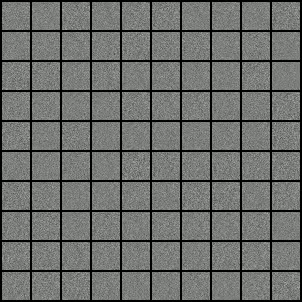

# GANs_MNIST_Pytorch
A GAN to generate images of digits based on MNIST Dataset

## Overview

Generative Adversarial Network is a framework for estimating generative models using an adversarial process.

The following diagram provides a hight level perspective of the work-flow of a GAN.

   

 
The loss function we are trying to optimize:

## Output
You can find the output generated after each epoch in the `output` folder.  

I have also accumulated them and created a video named `Output_GAN.mp4`.

Output after 300 epochs

 

## References 

[Generative Adversarial Networks](https://arxiv.org/abs/1406.2661)
